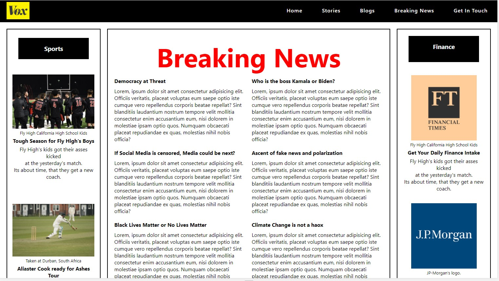
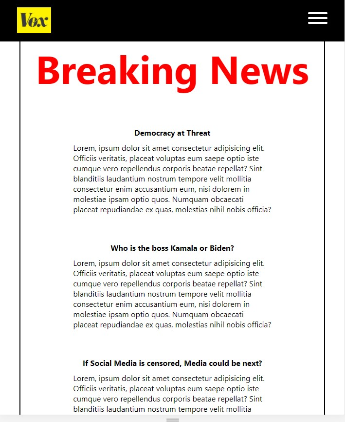
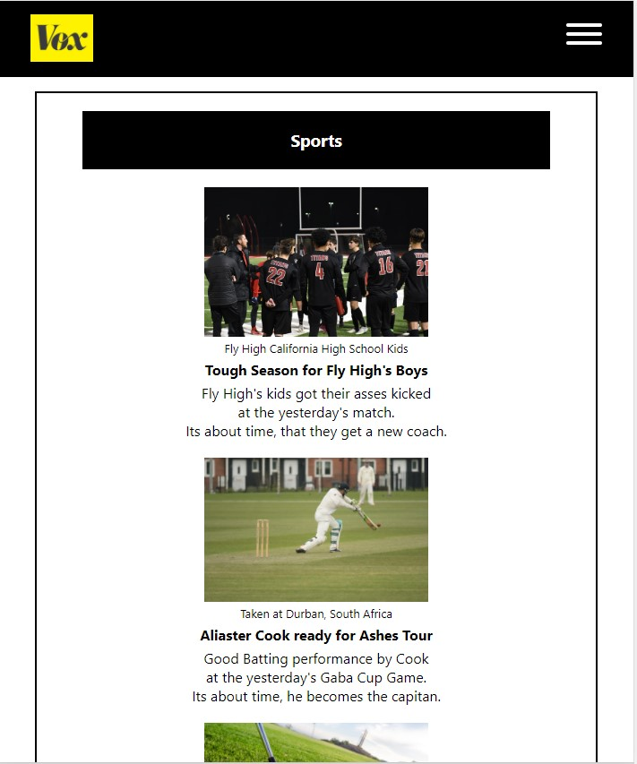
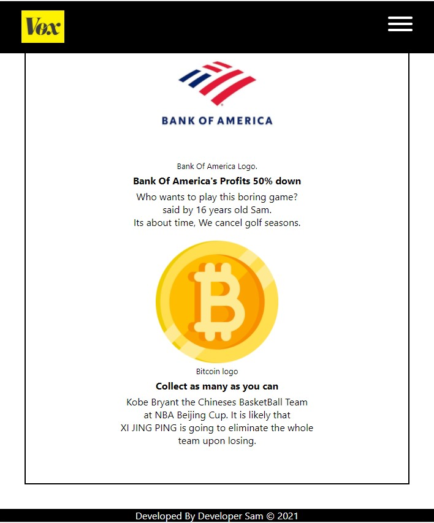
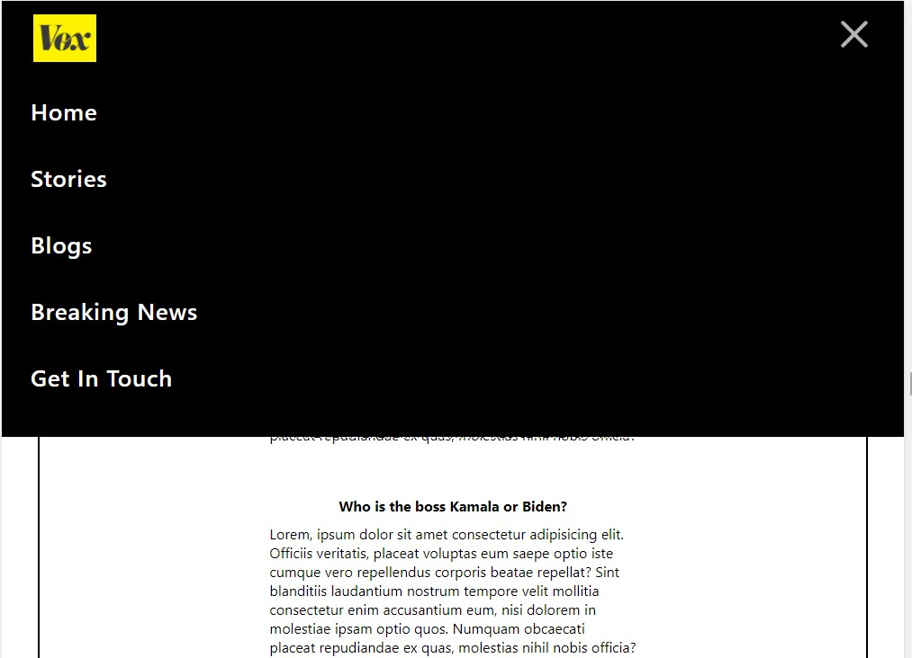

# Beginner News Website - with CSS GRID - Fully Responsive

This is built CSS grid and during media queries I have used bits of flexbox, this comes with Hamburger menu. I am just trying out nested grids and flexboxes in order to get comfortable with positioning of items and learning new layouts.

# Images

# Desktop View

;

# Mobile View - 100% Responsive till 320px

;

;

;

# Hamburger menu

;

# Developed by Developer Sam &copy; 2021
